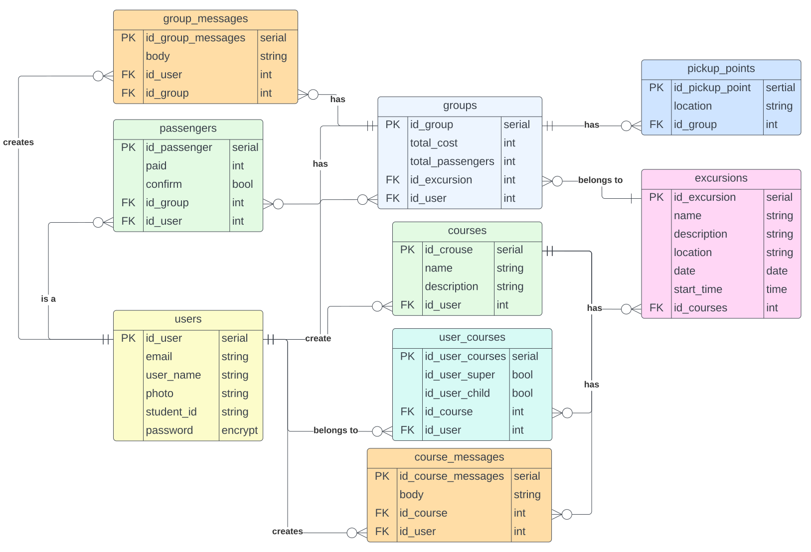

# Carpooling Web Application
### T2A2 - Marketplace Project.

## Requirement 7: The problem.

The School of Veterinary Science at University of Sydney main campus is located in Camperdown. A cohort is divided into several groups that are required to travel over an hour by car to another campus located in Camden to partake in practical veterinary tuition on different days for a year. There is no public transportation to the campus thus students need to take private transportation. However, a lot of students don’t have their own car  and one of the cheapest methods is carpooling.

In the beginning of the semester, there is a lot of confusion, because students need to separate themselves into groups and hope there are enough people with cars or drivers to carpool those students without cars. This process of arranging the groups and knowing who are the designated drivers can take up to a month to organise.
Another problem is some students feel awkward to ask about the process of splitting the travelling cost. Over a year of travelling to Camden, the travelling cost can be significantly high for the driver if the bill is not split evenly.

## Requirement 8: Why the problem needs solving

Before covid-19 lockdown, almost all colleges or universities held all their classes on campus. This made it easy for students to interact with each other outside tuition time. This interaction made it easy for students to organise themselves into groups, and planning off campus excursions.

During covid-19 lockdown, a lot of classes were moved online and remained online even though lockdown is over. Making it difficult for students to interact and organise off campus excursions.
Thus a web application is needed to just focus on off campus excursions that will make organising trips easier.

## Requirement 9: Deploy website

## Requirement 10: Repository

## Requirement 11: Marketplace Description

### Purpose

### Functionality / Features

### Stiemap

### Screenshots

### Target audience

### Tech stack

## Requirement 12: User stories

## Requirement 13: Wireframes

## Requirement 14: ERD

Figure 14.1: Entity Relationship Design for logged in users.

## Requirement 15: Different high-level components

## Requirement 16: Third party services

## Requirement 17: Models and relationships

## Requirement 18: Database relations to implemented

## Requirement 19: Database schema design

## Requirement 20: 